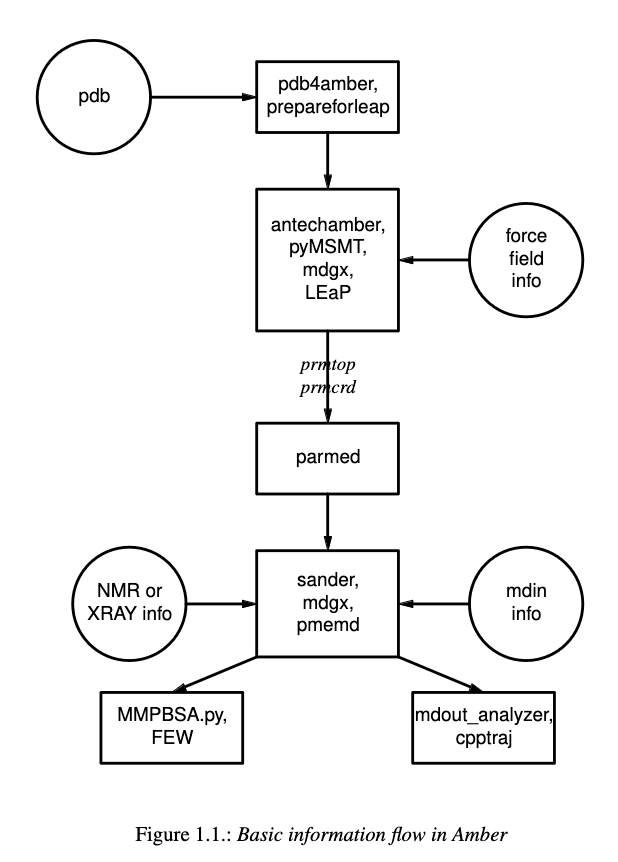

All atom implicit solvent
=========================

Adapted from `AMBER tutorial <https://ambermd.org/tutorials/basic/tutorial15/index.php>`_.
Read the full `manual <https://ambermd.org/doc12/Amber22.pdf>`_. 

Prepare structure
-----------------
Preparing structures with implicit solvents requires that we use the igb=8 parameter
as well as remove the periodic box argument. Because we aren't using solvent, 
we also don't need to solvate the system. 

Minimization
------------
Minimization is done like explicit solvents, simply keep the above parameters in mind.

Heating
-------
Heating is done like explicit solvents, simply keep the above parameters in mind.

Equilibration
-------------
Equilibration is done like explicit solvents, simply keep the above parameters in mind.

Production
----------
Production is done like explicit solvents, simply keep the above parameters in mind.

Analysis
--------