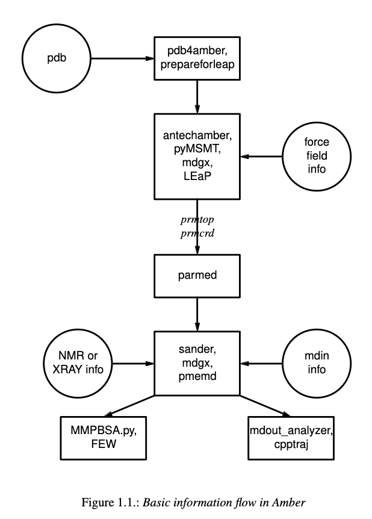

AMBER
=====

Adapted from `AMBER tutorial <https://ambermd.org/tutorials/basic/tutorial15/index.php>`_.
Read the full `manual <https://ambermd.org/doc12/Amber22.pdf>`_. 
See `github <https://github.com/Luger-Lab/MD-simulations>` 

Introduction
~~~~~~~~~~~~

AMBER is a suite of molecular dynamics programs that can be used to simulate
biomolecules at a variety of granularities. It is broken into two main parts.
AMBERTools, which includes the free-to-use MD engine, ``sander`` which runs on 
CPUs, as well as various analysis scripts. And AMBER, which is distributed 
through a license and includes the GPU-accelerated engine, ``pmemd``. We will
be using the ``pmemd`` version of the software.

.. image:: hamilitonian.png
   :width: 300
   :align: right

At the most basic level, MD simulations randomly move atoms over small timesteps
into new conformations, calculate the energy of the moves, and either accept or 
reject those moves. 

All-atom with explicit solvent
~~~~~~~~~~~~~~~~~~~~~~~~~~~~~~

Prepare structure
-----------------

Minimization
------------

Heating
-------

Equilibration
-------------

Production
----------

Analysis
--------

All-atom with implicit solvent
~~~~~~~~~~~~~~~~~~~~~~~~~~~~~~

Prepare structure
-----------------
Preparing structures with implicit solvents requires that we use the ``igb=8`` parameter
as well as remove the periodic box argument. Because we aren't using solvent, 
we also don't need to solvate the system. 

Minimization
------------
Minimization is done like explicit solvents, simply keep the above parameters in mind.

Heating
-------
Heating is done like explicit solvents, simply keep the above parameters in mind.

Equilibration
-------------
Equilibration is done like explicit solvents, simply keep the above parameters in mind.

Production
----------
Production is done like explicit solvents, simply keep the above parameters in mind.

Analysis
--------

Coarse-grained (implicit solvent)
~~~~~~~~~~~~~~~~~~~~~~~~~~~~~~~~~

Prepare structure
-----------------

Minimization
------------

Heating
-------

Equilibration
-------------

Production
----------

Analysis
--------