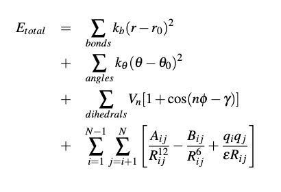
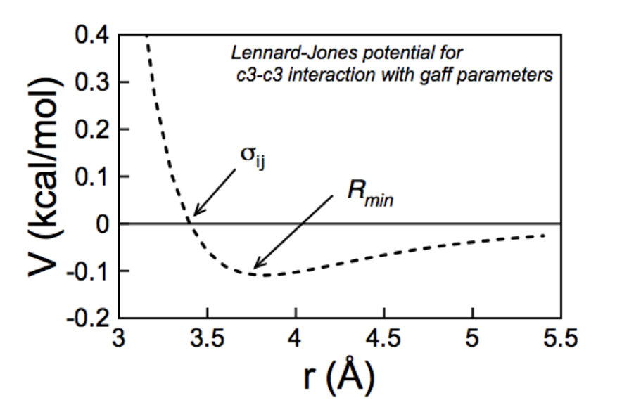

General MD simulations
======================

At the most basic level, molecular dynamics use the equations of Newtonian 
motion to simluate systems on an atomistic level. In an all atom molecular 
system, starting coordinates are obtained experimentally (through crystallography,
CryoEM, NMR, etc.) or built (AlphaFold, homology modeling, by hand). These 
coordinates are then parameterized with the forcefield of choice for the 
simulation. Periodic or non periodic boundaries are added and the simulation
volume is solvated and populated with ions. The system is then minimized and 
allowed to equilibrate to the simulation temperature and pressure. From here,
the simulation is allowed to run keeping various parameters constant. After
sufficient time has been simulated to sample the conformational space, the 
trajectory can be analyzed to determine physical attributes of the system. 

These steps generally:
    -   acquire starting model
    -   parameterize topology file 
    -   build simulation box
    -   minimize 
    -   equilibrate 
    -   simulate 
    -   analyze

In MD simulations atoms are placed a in starting structure as points of mass and 
charge and given random velocities which correspond to the set temperature of 
the system. Atoms are then moved to their next position by calculating the force 
acting on each point and multiplying by the mass through the set timestep.
The motion of such idealized points can be described through a set of Newtonian 
motion equations (right). Where the bond length and angles are modeled as springs,
dihedrals through torsion calculations, and van Der Waals interactions through
the Lennard-Jones potential. These first three terms describe the interaction of 
bonded atoms and thus have a finite and relatively small number of calculations. 
The non-bonded interactions described by the Lennard-Jones potential can, in theory 
describe the interaction of each atom with every other atom in the system and with
the atoms in the next periodic box. As, this would lead to a prohibitively large 
number of calculations per timestep and as the contribution of this term decays
rapidly with distance, a distance cutoff is almost always applied. 

